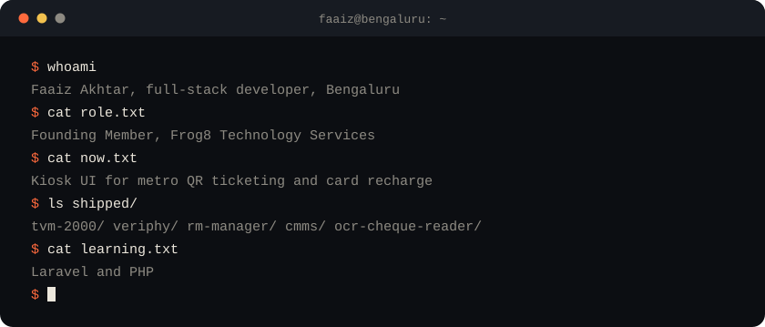
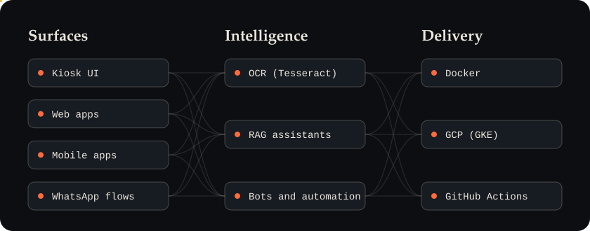
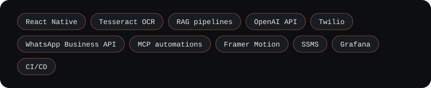
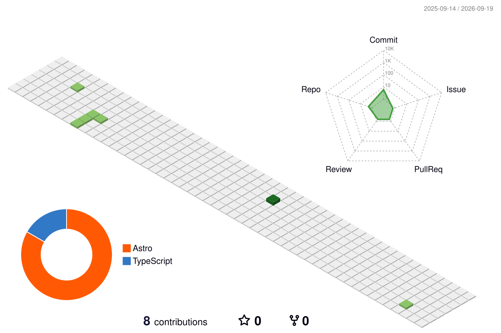

<picture>
  <source media="(prefers-color-scheme: dark)" srcset="./assets/header-dark.svg">
  <source media="(prefers-color-scheme: light)" srcset="./assets/header-light.svg">
  
</picture>

## About me

I am a full-stack software developer and a Founding Member of [Frog8 Technology Services](https://frog8.co.in) in Bengaluru. I build product-grade web, mobile and kiosk systems for banking, fintech and enterprise customers.

I work across the whole stack, from the database and APIs to deployment, and the front end is the part I enjoy most. Much of what I build is used by people in a hurry: a commuter buying a QR ticket at a metro station, a bank customer updating a passbook, or a field officer marking attendance on a phone. That has shaped how I work. I care about interfaces that are clear at first glance, flows that recover gracefully when the network or the hardware fails, and code that the next engineer can pick up without a walkthrough.

On the front end, I work with React, Next.js and TypeScript. On mobile, I use Flutter, React Native and native Android (Java and Kotlin). On the back end, I use Python, Flask, Django and C#. Around these, I build the automation that keeps products running: OCR pipelines with Tesseract, retrieval-augmented generation (RAG) assistants, messaging bots, and CI/CD pipelines to Google Cloud.

Outside client work, I enjoy real-time graphics and generative visuals with Three.js.

**How I work:** leadership, ownership, collaboration, problem solving and clear communication.

<picture>
  <source media="(prefers-color-scheme: dark)" srcset="./assets/kiosk-strip-dark.svg">
  <source media="(prefers-color-scheme: light)" srcset="./assets/kiosk-strip-light.svg">
  
</picture>

<picture>
  <source media="(prefers-color-scheme: dark)" srcset="./assets/terminal-dark.svg">
  <source media="(prefers-color-scheme: light)" srcset="./assets/terminal-light.svg">
  
</picture>

## Experience

<b>Frog8 Technology Services Pvt. Ltd.</b> · Founding Member and Software Developer · April 2025 to present · Bengaluru

 

- **BMRCL TVM 2000.** I delivered the end-to-end kiosk interface for QR ticketing and metro card recharge, with UPI, card and cash payments.
- **Frog8 investor-facing website.** I led the build in React, Next.js, TypeScript and Tailwind CSS, including the design system, responsive layouts, animations, and OTP and QR sign-in integrations.
- **Veriphy.** A WhatsApp-native onboarding product: QR deep links lead into WhatsApp, followed by KYC and the full document lifecycle, with OTP verification and audit trails.
- **RM Manager.** A field operations app built with Flutter and Android, covering geo-attendance, shift tracking, device assignment, WhatsApp escalations and leaderboards.
- **AI and automation.** Python and MCP automations (Twilio bots and scheduled pings), RAG-based in-app assistants, and CI/CD to GCP (GKE).

<b>Technocrafts Switchgear Pvt. Ltd.</b> · Software Engineer · November 2022 to March 2025 · Mumbai

 

- I built the Central Management and Monitoring System (CMMS) for passbook kiosks deployed with ICICI, Canara, Axis and HDFC.
- I developed a quality-control Android app (React Native, C# and MySQL) and an OCR cheque reader (Python and Tesseract).

<b>Forbes Technosys Ltd. (Shapoorji Pallonji)</b> · Software Engineer Intern · May 2019 to July 2019

 

- I consolidated back-end servers for 16 subsidiaries, implemented an SSO migration, and built responsive Angular interfaces with lazy loading.

<picture>
  <source media="(prefers-color-scheme: dark)" srcset="./assets/journey-dark.svg">
  <source media="(prefers-color-scheme: light)" srcset="./assets/journey-light.svg">
  
</picture>

## Selected projects

| Project | Description |
|---|---|
| **Caxman Store** ([caxmaneyewear.com](https://caxmaneyewear.com)) | A client storefront built with React, Next.js and Tailwind CSS, with a product catalogue, SEO metadata, image optimisation, and WhatsApp and direct-message order flows. |
| **IntelliKiosk** | A reference kiosk platform for QR and UPI ticketing, with on-device OCR, offline failover, over-the-air updates and telemetry. |
| **FinFlow** | WhatsApp-native onboarding using the WhatsApp Business API and Twilio OTP, with a RAG-backed compliance FAQ, secure KYC capture and document verification. |
| **DocuSense RAG** | A document assistant built on a RAG pipeline with multimodal (image-to-text) support, an embeddings store, retriever fusion, and an interface that cites its sources. |
| **OCR+** | A document OCR and layout analyser with advanced preprocessing, custom Tesseract training, layout-aware post-processing and a dashboard for monitoring accuracy. |
| **OpsSight** | A Flutter and Android app with Grafana dashboards for geofenced attendance, shift orchestration, offline-first sync and adaptive telemetry. |

**Public repositories:** [LetsGoa_Demo](https://github.com/faaiz09/LetsGoa_Demo) · [frog8-transit-fintech](https://github.com/faaiz09/frog8-transit-fintech) · [veriphy_updated](https://github.com/faaiz09/veriphy_updated) · [faaiz_portfolio](https://github.com/faaiz09/faaiz_portfolio)

## Publication

**Enhanced Haze Removal System**, Springer ICMETE 2021 (published February 2022). I designed a haze-removal algorithm based on the Dark Channel Prior and invariant features. The paper was accepted at the international conference.

## Education

**B.Tech. in Computer Science and Engineering**, SRM Institute of Science and Technology, Chennai, 2017 to 2021. I graduated with 85%.

## What I work across

<picture>
  <source media="(prefers-color-scheme: dark)" srcset="./assets/system-map-dark.svg">
  <source media="(prefers-color-scheme: light)" srcset="./assets/system-map-light.svg">
  
</picture>

## Skills

| Area | Tools |
|---|---|
| **Front end** | <picture><source media="(prefers-color-scheme: dark)" srcset="https://skillicons.dev/icons?i=react,nextjs,ts,js,vue,nuxtjs,angular,astro,vite,tailwind,threejs&perline=12&theme=dark"></picture> React, Next.js, TypeScript, JavaScript, Vue, Nuxt, Angular, Astro, Vite, Tailwind CSS, Framer Motion, Three.js |
| **Mobile and kiosk** | <picture><source media="(prefers-color-scheme: dark)" srcset="https://skillicons.dev/icons?i=flutter,dart,androidstudio,java,kotlin&perline=12&theme=dark"></picture> React Native, Flutter, Dart, Android (Java and Kotlin) |
| **Back end** | <picture><source media="(prefers-color-scheme: dark)" srcset="https://skillicons.dev/icons?i=py,flask,django,cs,cpp&perline=12&theme=dark"></picture> Python, Flask, Django, C#, C++ |
| **Data** | <picture><source media="(prefers-color-scheme: dark)" srcset="https://skillicons.dev/icons?i=mysql&perline=12&theme=dark"></picture> MySQL, SQL Server Management Studio (SSMS) |
| **AI and automation** | OCR (Tesseract), retrieval-augmented generation (RAG), OpenAI API |
| **Cloud and DevOps** | <picture><source media="(prefers-color-scheme: dark)" srcset="https://skillicons.dev/icons?i=docker,gcp,kubernetes,githubactions&perline=12&theme=dark"></picture> Docker, Google Cloud (GKE), CI/CD with GitHub Actions |
| **Also worked with** | <picture><source media="(prefers-color-scheme: dark)" srcset="https://skillicons.dev/icons?i=nodejs,firebase,linux,git,postman,opencv,tensorflow,pytorch,blender,arduino,bootstrap,sass&perline=12&theme=dark"></picture> Node.js, Firebase, Linux, Git, Postman, OpenCV, TensorFlow, PyTorch, Blender, Arduino, Bootstrap, Sass |

<picture>
  <source media="(prefers-color-scheme: dark)" srcset="./assets/toolbox-dark.svg">
  <source media="(prefers-color-scheme: light)" srcset="./assets/toolbox-light.svg">
  
</picture>

🌱 **Currently learning:** Laravel and PHP.

## GitHub activity

<picture>
  <source media="(prefers-color-scheme: dark)" srcset="./assets/stats-dark.svg">
  <source media="(prefers-color-scheme: light)" srcset="./assets/stats-light.svg">
  
</picture>

<picture>
  <source media="(prefers-color-scheme: dark)" srcset="https://raw.githubusercontent.com/faaiz09/faaiz09/output/pacman-contribution-graph-dark.svg">
  <source media="(prefers-color-scheme: light)" srcset="https://raw.githubusercontent.com/faaiz09/faaiz09/output/pacman-contribution-graph.svg">
  
</picture>

<picture>
  <source media="(prefers-color-scheme: dark)" srcset="./profile-3d-contrib/profile-night-rainbow.svg">
  <source media="(prefers-color-scheme: light)" srcset="./profile-3d-contrib/profile-green-animate.svg">
  
</picture>

The same graph as a game of Snake

 
<picture>
  <source media="(prefers-color-scheme: dark)" srcset="https://raw.githubusercontent.com/faaiz09/faaiz09/output/github-contribution-grid-snake-dark.svg">
  <source media="(prefers-color-scheme: light)" srcset="https://raw.githubusercontent.com/faaiz09/faaiz09/output/github-contribution-grid-snake.svg">
  
</picture>

## A fun fact

> [!TIP]
> Many developers strongly prefer dark mode. They say it saves their eyesight, and possibly their soul. This page follows your GitHub theme, so the choice is yours.

## Get in touch

I am open to full-time and contract roles, and I am happy to relocate or to work in a hybrid or remote arrangement.

&nbsp;
&nbsp;
&nbsp;

[faaizakhtar@gmail.com](mailto:faaizakhtar@gmail.com) · [linkedin.com/in/faaizakhtar](https://linkedin.com/in/faaizakhtar) · [kaggle.com/faaizakhtar](https://kaggle.com/faaizakhtar)

The header, kiosk banner, terminal, route map, system map, toolbox and stats card are SVGs generated by <a href="./scripts/build_assets.py">Python scripts</a> in this repository. They use no JavaScript and follow your light or dark theme.
